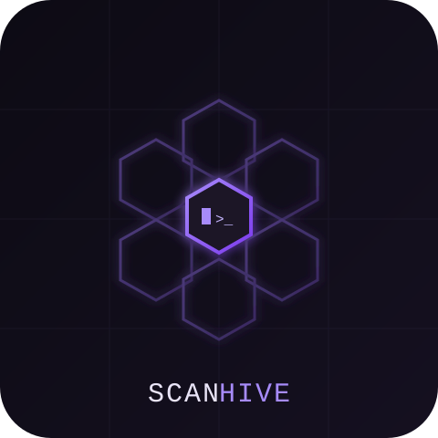

<div align="center">
  

  <h1>ScanHive Community</h1>

  <p><strong>Unified application security posture management for modern DevSecOps teams.</strong></p>
  <p>Consolidate SARIF results, remove duplicate noise, triage vulnerabilities, and manage security access across projects and organizations.</p>
</div>

## Overview

ScanHive Community is the free, self-hosted edition of ScanHive. It provides a central workspace for security results produced throughout the software delivery lifecycle, normalizing SARIF reports from supported scanners, correlating recurring findings, and presenting the current security posture through project-level and portfolio-level dashboards.

The platform is designed for multi-tenant deployments with organization isolation, project access controls, role-based authorization, and API keys. Anyone can register and create their own organization; organization admins invite teammates by shareable link.

## Editions

This repository contains **ScanHive Community**, the self-hosted, free edition of ScanHive.

> A feature comparison between ScanHive Community and other ScanHive editions will be added here later.

## Core capabilities

- Import and normalize SARIF 2.x reports.
- Classify scans as SAST, SCA, Secrets, Container Security, IaC, or DAST.
- Recognize common tools including Trivy, Semgrep, CodeQL, Snyk, Checkmarx, Fortify, Gitleaks, Grype, Checkov, KICS, OWASP ZAP, and others.
- Correlate results across scans to prevent duplicate vulnerability counts.
- Track new, recurrent, and fixed results.
- Triage results as To Verify, Confirmed, False Positive, Not Exploitable, or Fixed.
- Suppress previously triaged false positives in subsequent scans.
- Review project overview, scan history, scanner coverage, and vulnerability analytics.
- Export project, portfolio, and individual scan reports as PDF or CSV.
- Self-serve registration creates a new organization and its first administrator.
- Invite team members by shareable link, with roles assigned at invite time.
- Control access through users, roles, user groups, project assignments, and scoped permissions.
- Create user API keys with 365-day validity and regeneration support.


## Local development

### Prerequisites

- Docker Desktop with Docker Compose
- Git
- Node.js current LTS and npm (only required for optional frontend dev mode)

### 1. Configure the API

```bash
cp backend/.env.example backend/.env
```

| Variable | Purpose | Development default |
| --- | --- | --- |
| `DATABASE_URL` | SQLAlchemy PostgreSQL connection string | Provided in `.env.example` |
| `FRONTEND_URL` | Browser application URL, used to build invitation links | `http://localhost` |
| `SMTP_HOST` | SMTP server for invitation emails; blank disables sending | Blank |
| `SMTP_PORT`, `SMTP_USERNAME`, `SMTP_PASSWORD`, `SMTP_FROM_EMAIL`, `SMTP_FROM_NAME`, `SMTP_USE_TLS` | SMTP delivery settings | See `.env.example` |

### 2. Start the full application

```bash
docker compose up -d --build
```

This single command starts PostgreSQL, the API, and the web application (built and served as static assets — no dev server involved). Verify the services:

```bash
docker compose ps
curl http://localhost:8000/health
```

Open `http://localhost` once all three containers report as running.

The frontend's API address is baked in at image build time from `VITE_API_BASE_URL` (default `http://localhost:8000`). To point the built frontend at a different API address, set `VITE_API_BASE_URL` in your shell (or an `.env` file next to `docker-compose.yml`) before running `docker compose up -d --build`.

#### Frontend development mode (optional)

For frontend development with hot reload, run the web application outside Docker instead:

```bash
cd frontend
npm install
cp .env.example .env
npm run dev
```

The frontend reads its API address from `frontend/.env`:

```dotenv
VITE_API_BASE_URL=http://localhost:8000
```

Open `http://localhost:5173` after Vite starts. This runs alongside the Dockerized stack without a port conflict, since the containerized frontend serves on port 80. If you rely on invitation emails while in dev mode, set `FRONTEND_URL=http://localhost:5173` in `backend/.env` and restart the `backend` container so invite links point at the Vite dev server instead of port 80.

### Stop the environment

```bash
docker compose down
```

## SARIF ingestion

Upload endpoints accept SARIF 2.x files and require a project plus one of the supported scan types:

```text
SAST · SCA · Secrets · Container Security · IaC · DAST
```

The API derives the scanner name from the SARIF document and maps known aliases to canonical tool names. Results are normalized for severity and correlated within the project, scanner, and scan-type scope to identify new and recurrent vulnerabilities.

Use Swagger UI at `http://localhost:8000/docs` to test authenticated scan uploads and inspect the request schema.


## Security guidance

- Replace all development secrets before deploying ScanHive.
- Terminate TLS at the ingress and use HTTPS for the frontend and API.
- Keep PostgreSQL on a private network and remove public port exposure in production.
- Configure strict frontend origins instead of development CORS patterns.
- Rotate signing keys, API keys, and service credentials according to organizational policy.
- Invite links grant account creation for their target organization; treat them as sensitive and revoke unused invitations promptly.
- Review generated reports before sharing them outside the organization; they may contain source paths and vulnerability details.

## Additional documentation

- [Interactive API documentation](http://localhost:8000/docs) — available while the API is running

- [ScanHive documentation](https://scanhive.github.io/)

## Project status

ScanHive is under active development. Review configuration, access-control policy, migration strategy, and deployment hardening before using it in a production environment.
